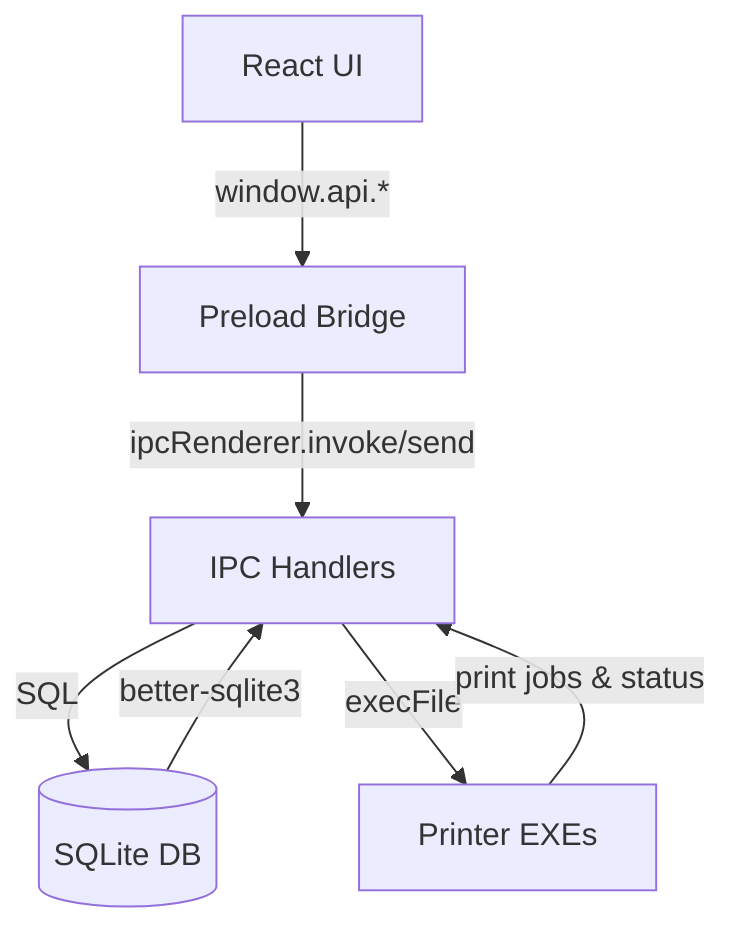

# Do'kondor - POS System Codebase Documentation

> **AI-Friendly Reference**  
> Last Updated: 2026-02-13  
> Version: 2.0.0

---

## Table of Contents

1. [Project Overview](#project-overview)
2. [Architecture](#architecture)
3. [Source Layout](#source-layout)
4. [Module Reference](#module-reference)
5. [Feature Workflows](#feature-workflows)
6. [Database Schema](#database-schema)
7. [IPC & Preload API Map](#ipc--preload-api-map)
8. [Renderer UI](#renderer-ui)
9. [Printer & External Integrations](#printer--external-integrations)
10. [Build & Tooling](#build--tooling)
11. [Quick Reference](#quick-reference)

---

## Project Overview

**Do'kondor** is an offline-first Electron POS tailored for Uzbek retail stores. It combines a SQLite (better-sqlite3) data layer, barcode and receipt printing through bundled C++ utilities, and a React-based selling experience. Key capabilities:

- Inventory onboarding and stock adjustments with automatic barcode generation.
- Fast cart building from SKU, barcode scan, or quick search, including customer-linked debt sales.
- Sales ledger with receipt reprints, payment history, and summary list.
- Print job journaling for both barcode and receipt printers to improve observability.
- Auto-migration logic for older databases to the new schema.

---

## Architecture

### Processes & Responsibilities

| Tier | Location | Responsibilities |
|------|----------|------------------|
| **Main process** | `src/main` | Window lifecycle, SQLite access, transactional sales logic, IPC handlers, printer orchestration. |
| **Preload** | `src/preload` | Context isolation bridge that exposes a curated `window.api` surface to the renderer. |
| **Renderer** | `src/renderer` | React UI (Sales console, product manager, sales history). |

### Runtime Flow



- **State** lives in SQLite (WAL mode). Renderer never talks to the DB directly.
- **Transactions** (better-sqlite3 `.transaction`) guarantee that sales, stock deductions, debt tracking, and print queue inserts succeed atomically.
- **Printing** uses synchronous `execFile` calls plus persisted `print_jobs` rows so failures can be retried.

---

## Source Layout

```
src/
+- main/
¦  +- index.ts              # Electron bootstrap + lifecycle hooks
¦  +- db/index.ts           # SQLite setup, migrations, helpers
¦  +- ipc/index.ts          # All IPC handlers and business logic
¦  L- services/printers.ts  # Wrapper over barcode/receipt executables
+- preload/
¦  +- index.ts              # contextBridge exposure of API surface
¦  L- index.d.ts            # Global window typings for renderer
L- renderer/
   +- index.html
   L- src/
      +- main.tsx           # React entry
      +- App.tsx            # Layout composition
      L- components/
         +- Header.tsx
         +- SalesPage.tsx
         +- ProductManager.tsx
         L- SalesHistory.tsx
```

Supporting files:
- `electron.vite.config.ts` wires Vite for main/preload/renderer builds.
- `electron-builder.yml` configures packaging, appId (`com.owner.app`), and resource bundling (printer binaries packaged under `resources/bin`).
- `dev-app-update.yml` configures electron-updater feed (generic provider placeholder).

---

## Module Reference

### Main Entry (`src/main/index.ts`)
- Creates one `BrowserWindow` (1024x768, menu hidden) and routes to dev server or built HTML.
- Calls `initializeDatabase()` before registering IPC so that every handler can call `getDB()` safely.
- Hooks `app.on('browser-window-created')` to enable Electron Toolkit keyboard shortcuts.
- On shutdown (non-macOS), closes the SQLite handle to flush WAL before quitting.

### Database Layer (`src/main/db/index.ts`)
- Stores data at `{app.getPath('userData')}/pos_system.db`.
- Applies critical PRAGMAs: `foreign_keys`, `journal_mode = WAL`, `busy_timeout`, `synchronous = NORMAL`.
- Creates and migrates tables for products, customers, sales, sale_items, payments, stock_movements, debts, debt_transactions, and print_jobs.
- `migrateLegacyProducts()` inspects schema via `PRAGMA table_info` to backfill new columns (barcode, money-in-cents fields, timestamps) without dropping data.
- `mapProductRow()` normalizes DB rows to renderer expectations (price in sums, qty => stock).

### IPC Handlers (`src/main/ipc/index.ts`)
Handlers are registered once on app start. Highlights:

- **Inventory**: `get-products`, `add-product`, `find-product`, `set-stock` (writes `stock_movements`).
- **Sales**: `create-sale` enforces stock availability, manages customer onboarding, computes totals/discount/tax, writes `sales`, `sale_items`, `payments` or debt records, and decrements inventory in a single transaction.
- **Ledger**: `get-sales` returns the latest 50 sales with customer name, `get-sale-items` fetches line items, `pay-debt` logs into `debt_transactions` and closes open `debts` rows.
- **Printing**: `trigger-print`/`trigger-receipt` support legacy fire-and-forget flows, while `print-barcode-product` and `print-receipt-sale` ensure a `print_jobs` ledger row per attempt and return success/failure to the renderer.

### Printer Service (`src/main/services/printers.ts`)
- Resolves executable path depending on `app.isPackaged`.
- `printLabelByProduct` lazily generates an EAN-8 barcode when none exists (using `generateEAN8FromId` + collision retries) and logs the attempt to `print_jobs` before running `testbarcode.exe` `copies` times.
- `printReceiptBySale` rehydrates sale totals + items, formats the legacy `name|price` string, inserts a queued job, and executes `receipt.exe`.
- Both methods update `print_jobs.status` to `done` or `failed` with `error` text for observability.

### Preload Bridge (`src/preload/index.ts`)
- Exposes both the Electron helper API (`window.electron`) and a typed `window.api` object.
- API surface mirrors the IPC handlers and always returns Promises for invoke-based channels.
- Keeps printer helpers (`printBarcode`, `printReceipt`) available for compatibility while new job-based APIs exist.

---

## Feature Workflows

### Inventory Lifecycle
1. Clerk enters SKU/name/price in `ProductManager`.
2. Renderer calls `window.api.addProduct` > `ipcMain.handle('add-product')` inserts row (price stored in cents) with default qty=0.
3. Stock adjustments use `set-stock`, logging every change into `stock_movements` with before/after qty.
4. Barcode labels are requested with `printBarcodeByProduct`, which ensures the product has a barcode and queues the print job.

### Sales & Debt Workflow
1. `SalesPage` builds a cart from manual search, quick list, or barcode scanner input via `find-product` fallback.
2. Checkout posts `create-sale` payload containing `items`, `paymentMethod`, optional discount, and customer data if the sale is on debt.
3. The transaction verifies stock, computes totals, writes `sales`/`sale_items`, and decreases qty per line. Payments table receives cash/card entries; debt sales create `debt_transactions` + `debts` snapshot and increment `customers.debt_cents`.
4. Any outstanding customer balance can later be reduced via `pay-debt`, which logs a payment transaction and marks oldest open debts as paid once thresholds are met.

### Sales History & Reprints
- `SalesHistory` fetches the 50 most recent sales for quick review.
- Selecting a sale triggers `get-sale-items` so the UI can display line-level totals.
- Clicking “Chek chiqarish” invokes `printReceiptBySale`, which reuses persisted sale data instead of recomputing totals in the renderer.

### Printing Strategy
- Legacy `printBarcode` and `printReceipt` functions still exist for compatibility but do not write to `print_jobs`.
- Newer receipt/barcode printing endpoints store structured payloads first, then execute the binary so offline auditing and retries are possible.

---

## Database Schema

| Table | Purpose | Key Columns |
|-------|---------|-------------|
| `products` | Inventory catalog. | `sku` (unique), `barcode`, `unit`, `cost_cents`, `price_cents`, `qty`, `min_stock`, timestamps. |
| `customers` | Customer directory + rolling debt. | `name`, `phone` (unique), `debt_cents`, timestamps. |
| `sales` | Sale headers. | `customer_id`, `sale_date`, subtotal/discount/tax/total cents, `payment_method`, `note`. |
| `sale_items` | Line-level detail. | `sale_id` FK, `product_id`, cached metadata, `quantity`, `unit_price_cents`, `line_total_cents`, `profit_cents`. |
| `payments` | Cash/card settlement history. | `sale_id`, `method`, `amount_cents`. |
| `stock_movements` | Audit trail for all qty changes. | `movement_type` enum, `quantity_change`, `old_qty`, `new_qty`, optional references. |
| `debts` | Snapshot of outstanding balances per sale. | `customer_id`, `description`, `total_cents`, `paid_cents`, `is_paid`, `due_date`. |
| `debt_transactions` | Event log of debt added vs payments. | `type` enum (`debt_added`, `payment`), `amount_cents`, `note`. |
| `print_jobs` | Persistence layer for prints. | `kind` enum, `product_id`/`sale_id`, `copies`, `status`, `payload`, `error`, timestamps. |

**Indexes & Triggers** (see `INDEXES_AND_TRIGGERS` string):
- Search helpers: products by `barcode` and `name`, sales by date, sale items by product, stock movements by product+date, customers by phone, debts by customer+status.
- Update triggers keep `products.updated_at` and `customers.updated_at` fresh after every update.

**Money Handling**: All monetary values are stored as integer cents to avoid floating point drift. Renderer converts back to so'm via division by 100.

---

## IPC & Preload API Map

| Renderer Call | IPC Channel | Location | Notes |
|---------------|-------------|----------|-------|
| `window.api.getProducts()` | `get-products` | `src/main/ipc/index.ts` | Returns active products sorted by name, using `mapProductRow`. |
| `window.api.addProduct(sku, name, price)` | `add-product` | same | Price converted to cents, qty defaults to 0. |
| `window.api.findProduct(code)` | `find-product` | same | Looks up by barcode or SKU. |
| `window.api.setStock(productId, qty)` | `set-stock` | same | Wraps movement logging transaction. |
| `window.api.createSale(payload)` | `create-sale` | same | Transactional checkout, returns `{ saleId, total_cents }`. |
| `window.api.getSales()` | `get-sales` | same | Latest 50 rows with customer join. |
| `window.api.getSaleItems(saleId)` | `get-sale-items` | same | Returns product_name, quantity, pricing info. |
| `window.api.payDebt(customerId, amountCents)` | `pay-debt` | same | Logs payment and updates open debts. |
| `window.api.printBarcode(...)` | `trigger-print` | same | Legacy fire-and-forget. |
| `window.api.printReceipt(...)` | `trigger-receipt` | same | Legacy fire-and-forget. |
| `window.api.printBarcodeByProduct(productId, copies?)` | `print-barcode-product` | same | Inserts `print_jobs` row then runs binary. |
| `window.api.printReceiptBySale(saleId, printerName?)` | `print-receipt-sale` | same | Returns `{ success, error? }`. |

Every invoke-based handler propagates thrown errors to the renderer (caught as rejected Promise). Caller components display friendly messages around these failures.

---

## Renderer UI

| Component | File | Responsibilities |
|-----------|------|------------------|
| `App` | `src/renderer/src/App.tsx` | High-level layout. Renders `Header`, `SalesPage`, `ProductManager`, `SalesHistory`. |
| `Header` | `components/Header.tsx` | Simple nav/title placeholder. |
| `SalesPage` | `components/SalesPage.tsx` | Cart UX, barcode scanning, search suggestions, checkout with discount, payment mode (cash/card/debt), and debt-only customer capture. Uses `window.api.findProduct`, `createSale`, etc. |
| `ProductManager` | `components/ProductManager.tsx` | CRUD-lite interface to add products, inspect stock, trigger barcode printing, and push qty changes. Maintains inline error/loading states. |
| `SalesHistory` | `components/SalesHistory.tsx` | Lists last 50 sales, fetches detailed items on selection, reprints receipts via `printReceiptBySale`. |

Renderer relies solely on inline styles today, but components are small and can be restyled without touching business logic.

---

## Printer & External Integrations

- Executables (`testbarcode.exe`, `receipt.exe`) are packaged inside `resources/bin` (dev) or `process.resourcesPath/bin` (prod).
- Printer names are currently hardcoded (`label` and `receipt`). If deployments differ, update `PrinterService` constants or add configuration.
- `runExec()` wraps `execFile` in a Promise for easier `async/await` usage inside the printer service.
- Print payload examples:
  - Barcode: `{ printer: 'label', barcode: '00012345', name: 'Tea', copies: 2 }`.
  - Receipt: `{ printer: 'receipt', storeName: "Do'kon", itemsString: 'Tea|15000;Sugar|12000', total: '27000' }`.

Failure handling: when binaries fail, the corresponding `print_jobs` row records `status = 'failed'` and `error = err.message`; renderer receives a `{ success: false, error }` response for receipt prints.

---

## Build & Tooling

| Script | Purpose |
|--------|---------|
| `npm run dev` | electron-vite development mode (type-safe React + Electron with HMR).
| `npm run build` | Type checks both node/web targets then builds all entry points.
| Platform builds (`build:win`, `build:mac`, `build:linux`) | Run build + electron-builder for platform-specific artifacts.
| `npm run typecheck` | Convenience alias for both `tsconfig.node.json` and `tsconfig.web.json`.
| `npm run lint` | ESLint over the full monorepo.
| `npm run format` | Prettier across the repo.

**Packaging Notes**:
- `electron-builder.yml` sets `asarUnpack` to `resources/bin/**` so the printer executables remain extractable at runtime.
- Auto updates rely on `electron-updater` and `dev-app-update.yml`; configure the feed URL before shipping.

---

## Quick Reference

- Database path (Windows dev): `%APPDATA%/Do'kondor/pos_system.db` (actual folder depends on appId `com.owner.app`).
- Money helper: always convert renderer so'm input via `Math.round(price * 100)` before storing.
- All renderer-to-main calls must go through `window.api`; never reach into `ipcRenderer` directly to keep context isolation intact.
- When adding a new backend capability:
  1. Implement SQL + handler in `src/main/ipc/index.ts`.
  2. Expose matching method in `src/preload/index.ts` and update `index.d.ts`.
  3. Consume via `window.api` in React.
- To inspect DB quickly during dev: `sqlite3 %APPDATA%/Do'kondor/pos_system.db` and run SQL queries (`.schema`, `SELECT * FROM print_jobs ORDER BY id DESC LIMIT 5;`).

This document now reflects the expanded multi-table schema, transactional sales logic, and print job journaling introduced in version 2.0.0.
