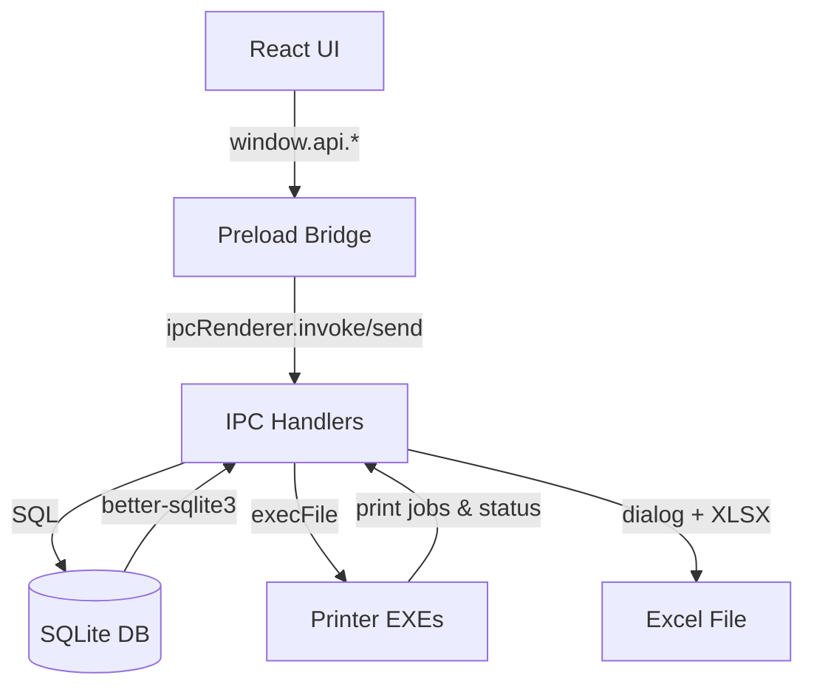

# Do'kondor - POS System Codebase Documentation

> **AI-Friendly Reference**
> Last Updated: 2026-02-16
> Version: 2.0.0

---

## Table of Contents

1. [Project Overview](#project-overview)
2. [Architecture](#architecture)
3. [Source Layout](#source-layout)
4. [Module Reference](#module-reference)
5. [Feature Workflows](#feature-workflows)
6. [Database Schema](#database-schema)
7. [IPC & Preload API Map](#ipc--preload-api-map)
8. [Renderer UI](#renderer-ui)
9. [Printer & External Integrations](#printer--external-integrations)
10. [Build & Tooling](#build--tooling)
11. [Quick Reference](#quick-reference)

---

## Project Overview

**Do'kondor** is an offline-first Electron POS tailored for Uzbek retail stores. It combines a SQLite (better-sqlite3) data layer, barcode and receipt printing through bundled executables, and a React-based selling experience. Key capabilities:

- Inventory onboarding with unit selection, barcode auto-generation, and stock adjustments.
- Authenticated access (single owner user) with password setup, login, and change-password flow.
- Fast cart building from barcode scans or search, including debt sales tied to customers.
- Sales ledger with reprints, date range filters, and Excel export.
- Debt ledger with per-debt payments, deletion, and full export/clear flows.
- Analytics dashboard plus warehouse (inventory) report with period-based summaries.
- Print job journaling for both barcode and receipt printers.
- Auto-migration logic for older databases to the new schema.

---

## Architecture

### Processes & Responsibilities

| Tier | Location | Responsibilities |
|------|----------|------------------|
| **Main process** | `src/main` | Window lifecycle, SQLite access, transactional sales logic, IPC handlers, auth session, analytics reporting, printer orchestration, Excel export. |
| **Preload** | `src/preload` | Context isolation bridge that exposes a curated `window.api` surface to the renderer. |
| **Renderer** | `src/renderer` | React UI (AuthGate, Sales, Inventory, History, Debts, Analytics, Warehouse report, Security settings). |

### Runtime Flow



- **State** lives in SQLite (WAL mode). Renderer never talks to the DB directly.
- **Transactions** (better-sqlite3 `.transaction`) guarantee that sales, stock deductions, debt tracking, and print queue inserts succeed atomically.
- **Printing** uses `execFile` calls plus persisted `print_jobs` rows so failures can be audited.

---

## Source Layout

```
src/
+- main/
¦  +- index.ts              # Electron bootstrap + lifecycle hooks
¦  +- db/index.ts           # SQLite setup, migrations, helpers
¦  +- ipc/index.ts          # All IPC handlers and business logic
¦  L- services/printers.ts  # Wrapper over barcode/receipt executables
+- preload/
¦  +- index.ts              # contextBridge exposure of API surface
¦  L- index.d.ts            # Global window typings for renderer
L- renderer/
   +- index.html
   L- src/
      +- main.tsx           # React entry
      +- App.tsx            # Layout composition + section switcher + AuthGate
      +- hooks/useProducts.ts
      +- lib/classNames.ts
      +- components/
      ¦  +- AuthGate.tsx
      ¦  +- Sidebar.tsx
      ¦  +- SalesPage.tsx
      ¦  +- ProductManager.tsx
      ¦  +- SalesHistory.tsx
      ¦  +- Debts.tsx
      ¦  +- AnalysisPage.tsx
      ¦  +- OmborReportPage.tsx
      ¦  +- SecuritySettings.tsx
      ¦  L- ui/ (Button, Modal, Pagination, DateRangeFilter, etc.)
      +- styles/ (CSS variables + global styles)
```

Supporting files:
- `electron.vite.config.ts` wires Vite for main/preload/renderer builds.
- `electron-builder.yml` configures packaging, appId (`com.owner.app`), and resource bundling (printer binaries packaged under `resources/bin`).
- `dev-app-update.yml` configures electron-updater feed (generic provider placeholder).

---

## Module Reference

### Main Entry (`src/main/index.ts`)
- Creates one `BrowserWindow` (1024x768, menu hidden) and routes to dev server or built HTML.
- Calls `initializeDatabase()` before registering IPC so every handler can call `getDB()` safely.
- Hooks `app.on('browser-window-created')` to enable Electron Toolkit keyboard shortcuts.
- On shutdown (non-macOS), closes the SQLite handle to flush WAL before quitting.

### Database Layer (`src/main/db/index.ts`)
- Stores data at `{app.getPath('userData')}/pos_system.db`.
- Applies PRAGMAs: `foreign_keys`, `journal_mode = WAL`, `busy_timeout`, `synchronous = NORMAL`.
- Creates and migrates tables for products, customers, app_users, sales, sale_items, payments, stock_movements, debts, debt_transactions, and print_jobs.
- `migrateLegacyProducts()` inspects schema via `PRAGMA table_info` to backfill new columns (barcode, cents fields, timestamps) without dropping data.
- `migrateLegacyDebtColumns()` backfills `debts.sale_id` and `debts.paid_at`, and auto-maps legacy `description` strings like `Sotuv #123`.
- `mapProductRow()` normalizes DB rows to renderer expectations (price in so'm, qty => stock, includes `min_stock`).

### IPC Handlers (`src/main/ipc/index.ts`)
Handlers are registered once on app start. Highlights:

- **Auth**:
  - `auth-status` returns `{ hasOwner, authenticated, username }`.
  - `auth-setup-owner` creates the initial `app_users` row (role `Do'kondor`).
  - `auth-login`/`auth-logout`/`auth-change-password` manage the in-memory session (`authSessionUserId`).
- **Inventory**:
  - `get-products` returns only active rows (`active = 1`) and auto-generates missing barcodes before returning data.
  - `delete-product` performs a soft delete and surfaces historical `sale_items` / `stock_movements` counts; requires an explicit `force` when history exists.
  - `add-product` enforces a unit whitelist (`dona|qadoq|litr|metr`), rounds price to cents, clamps initial qty to a non-negative integer, and can auto-generate barcode + SKU.
  - `update-product` validates fields and updates SKU/name/price/unit/barcode; if barcode is blank, it is auto-generated.
  - `find-product` looks up **barcode only**.
  - `set-stock` logs an `adjustment` entry in `stock_movements` with old/new qty.
- **Sales**:
  - `create-sale` enforces stock availability, deduplicates customers by phone when provided, computes totals/discount/tax, writes `sales`, `sale_items`, and inventory movements in a single transaction.
  - `sales.payment_method` accepts `cash|card|mixed|debt` in the schema, but `payments.method` only accepts `cash|card`.
- **Ledger**:
  - `get-sales` returns the latest 50 sales with customer name and phone.
  - `get-sales-all` returns all sales.
  - `get-sale-items` fetches line items with unit/barcode.
  - `clear-sales-records` removes all sales and any sale-linked debt rows, then recalculates `customers.debt_cents`.
- **Debt**:
  - `pay-debt` applies payments to the oldest open debts for a customer.
  - `get-debts` returns grouped debt rows with items and last-payment timestamps.
  - `pay-debt-record` applies a payment to a single debt row.
  - `delete-debt-record` removes a debt row and rebalances customer debt.
  - `clear-debts-records` clears all debt + debt_transactions data.
- **Analytics**:
  - `get-analytics-report` provides summary totals, payment split, daily totals, top products, and inventory rollups for an optional `from/to` range.
  - When a date range is supplied, it also returns a previous-period comparison of equal length.
- **Export**:
  - `export-sales-excel` opens a save dialog and writes an `.xlsx` file using the provided headers + rows.
- **Printing**:
  - `trigger-print`/`trigger-receipt` support legacy fire-and-forget flows, while `print-barcode-product` and `print-receipt-sale` ensure a `print_jobs` ledger row per attempt and return success/failure to the renderer.

### Printer Service (`src/main/services/printers.ts`)
- Resolves executable path depending on `app.isPackaged`; in dev it falls back to `resources/bin` under repo root and surfaces missing-binary errors early for barcode labels.
- `printLabelByProduct` lazily generates an EAN-8 barcode when none exists, accepts `printerName`, logs to `print_jobs`, and runs `label.exe` `copies` times.
- `printReceiptBySale` rehydrates sale totals + items, formats the legacy `name|unit_price` string, inserts a queued job, and executes `receipt2.exe` (fallback: `receipt.exe`).
- Both methods update `print_jobs.status` to `done` or `failed` with `error` text for observability.

### Preload Bridge (`src/preload/index.ts`)
- Exposes both the Electron helper API (`window.electron`) and a typed `window.api` object.
- API surface mirrors the IPC handlers and always returns Promises for invoke-based channels.
- Keeps printer helpers (`printBarcode`, `printReceipt`) available for compatibility while new job-based APIs exist.

---

## Feature Workflows

### Authentication & Security
1. On startup `App.tsx` calls `getAuthStatus` to decide whether to show `AuthGate` or the main UI.
2. First run: `AuthGate` calls `setupOwner` (creates the `app_users` row).
3. Subsequent runs: `AuthGate` calls `login` and sets an in-memory session.
4. `SecuritySettings` allows the owner to change password or log out.

### Inventory Lifecycle
1. Clerk opens the add-product modal and enters name/price/unit/initial qty; barcode is optional.
2. Renderer calls `window.api.addProduct` and receives `{ productId, barcode }` on success.
3. If barcode was empty, the system generates an EAN-8 barcode and, when SKU was missing, sets SKU to the new barcode.
4. Stock adjustments use `set-stock`, logging every change into `stock_movements` with before/after qty.
5. Barcode labels are requested with `printBarcodeByProduct`, which queues a print job and executes `label.exe`.
6. Product edits use `updateProduct` to change name/price/unit/barcode and auto-fill a barcode when blank.

### Sales & Debt Workflow
1. `SalesPage` builds a cart from barcode scans or search suggestions.
2. Checkout posts `create-sale` payload containing `items`, `paymentMethod`, optional discount, and customer data for debt sales.
3. The transaction verifies stock, computes totals, writes `sales`/`sale_items`, and decreases qty per line.
4. Payments are stored in `payments` for `cash` or `card`; debt sales create `debt_transactions` + `debts` snapshot and increment `customers.debt_cents`.
5. After a successful sale the renderer can call `printReceiptBySale` so the print uses persisted sale data.
6. Outstanding customer balance can be reduced via `pay-debt` (oldest-first) or `pay-debt-record` (specific debt).

### Sales History, Filters, and Excel Export
- `SalesHistory` fetches the 50 most recent sales for quick review, with client-side filters (payment type, text search, date range) and pagination.
- Selecting a sale triggers `get-sale-items` to display line-level totals in a modal.
- Clicking “Chek chiqarish” invokes `printReceiptBySale`, which reuses persisted sale data instead of recomputing totals in the renderer.
- “Excel eksport” gathers sale items per sale and calls `exportSalesExcel`, which prompts for a file path and writes the `.xlsx` file.
- “Sotuvlarni tozalash” calls `clearSalesRecords` after the user confirms.

### Debts: List, Pay, Export, Clear
- `Debts` uses `getDebts` to show grouped debt rows with line items, status, and totals.
- Per-debt payments call `payDebtRecord`; customer-wide payments can call `payDebt`.
- Debt rows can be deleted via `deleteDebtRecord`, and the entire debt ledger can be cleared via `clearDebtsRecords`.
- Excel exports re-use `exportSalesExcel` with debt-specific headers.

### Analytics & Warehouse Reports
- `AnalysisPage` calls `getAnalyticsReport` to show summary totals, payment split, daily revenue, and top products.
- A two-month comparison loads two separate reports (month A vs month B) from the same analytics endpoint.
- `OmborReportPage` uses `getAnalyticsReport` inventory data to show stock, min stock, and period sales by product.
- Both reports include Excel exports using `exportSalesExcel`.

---

## Database Schema

| Table | Purpose | Key Columns |
|-------|---------|-------------|
| `products` | Inventory catalog. | `sku` (unique), `barcode`, `unit`, `cost_cents`, `price_cents`, `qty` (REAL), `min_stock`, `active`, timestamps. |
| `customers` | Customer directory + rolling debt. | `name`, `phone` (unique), `email`, `address`, `debt_cents`, timestamps. |
| `app_users` | Single owner credentials. | `username` (unique), `role` (`Do'kondor`), `password_salt`, `password_hash`, timestamps. |
| `sales` | Sale headers. | `customer_id`, `sale_date` (Tashkent time), subtotal/discount/tax/total cents, `payment_method` (`cash|card|mixed|debt`), `note`. |
| `sale_items` | Line-level detail. | `sale_id` FK, `product_id`, `product_name`, `barcode`, `quantity`, `unit_price_cents`, `cost_cents`, `line_total_cents`, `profit_cents`. |
| `payments` | Cash/card settlement history. | `sale_id`, `method` (`cash`/`card`), `amount_cents`. |
| `stock_movements` | Audit trail for all qty changes. | `movement_type` (`initial|receive|sale|return|adjustment`), `quantity_change`, `old_qty`, `new_qty`, pricing context, timestamps. |
| `debts` | Snapshot of outstanding balances per sale. | `customer_id`, `sale_id`, `description`, `total_cents`, `paid_cents`, `is_paid`, `due_date`, `paid_at`, `created_at`. |
| `debt_transactions` | Event log of debt added vs payments. | `type` (`debt_added|payment`), `amount_cents`, `note`. |
| `print_jobs` | Persistence layer for prints. | `kind` (`barcode|receipt`), `copies`, `status` (`queued|sent|failed|done`), `payload`, `error`, timestamps. |

Soft deletes: Products are deactivated by setting `active = 0`; `get-products` filters on this flag while historical references remain intact.

Indexes & triggers (see `INDEXES_AND_TRIGGERS` string):
- Search helpers: products by `barcode` and `name`, sales by date, sale items by product, stock movements by product+date, customers by phone, debts by customer+status.
- Update triggers keep `products.updated_at`, `customers.updated_at`, and `app_users.updated_at` fresh after every update.

Money handling: All monetary values are stored as integer cents to avoid floating point drift. Renderer converts back to so'm via division by 100.

---

## IPC & Preload API Map

| Renderer Call | IPC Channel | Location | Notes |
|---------------|-------------|----------|-------|
| `window.api.getAuthStatus()` | `auth-status` | `src/main/ipc/index.ts` | Returns `{ hasOwner, authenticated, username }`. |
| `window.api.setupOwner(...)` | `auth-setup-owner` | same | Creates owner account if none exists. |
| `window.api.login(...)` | `auth-login` | same | Verifies credentials and sets session. |
| `window.api.logout()` | `auth-logout` | same | Clears in-memory session. |
| `window.api.changePassword(...)` | `auth-change-password` | same | Updates owner password. |
| `window.api.getProducts()` | `get-products` | same | Returns active products sorted by name, auto-fills missing barcodes. |
| `window.api.deleteProduct(id, force?)` | `delete-product` | same | Soft delete; when history exists returns counts and `requiresConfirmation` until forced. |
| `window.api.addProduct(sku, name, price, unit?, qty?, barcode?)` | `add-product` | same | Price converted to cents; unit coerced to whitelist; qty rounded and clamped to 0+. |
| `window.api.updateProduct(productId, payload)` | `update-product` | same | Updates SKU/name/price/unit/barcode and auto-generates barcode if blank. |
| `window.api.findProduct(code)` | `find-product` | same | Barcode-only lookup. |
| `window.api.setStock(productId, qty)` | `set-stock` | same | Wraps movement logging transaction. |
| `window.api.createSale(payload)` | `create-sale` | same | Transactional checkout; returns `{ saleId, total_cents }`. |
| `window.api.getSales()` | `get-sales` | same | Latest 50 rows with customer join. |
| `window.api.getSalesAll()` | `get-sales-all` | same | All sales rows with customer join. |
| `window.api.getSaleItems(saleId)` | `get-sale-items` | same | Returns product_name, barcode, unit, quantity, pricing info. |
| `window.api.clearSalesRecords()` | `clear-sales-records` | same | Clears sales + sale-linked debts, recalculates customer debt. |
| `window.api.getAnalyticsReport(...)` | `get-analytics-report` | same | Summary + daily + top products + inventory. |
| `window.api.payDebt(customerId, amountCents)` | `pay-debt` | same | Logs payment and updates open debts. |
| `window.api.getDebts()` | `get-debts` | same | Aggregated debts with items. |
| `window.api.payDebtRecord(debtId, amountCents)` | `pay-debt-record` | same | Pays a specific debt row. |
| `window.api.deleteDebtRecord(debtId)` | `delete-debt-record` | same | Deletes a debt row. |
| `window.api.clearDebtsRecords()` | `clear-debts-records` | same | Clears all debt history. |
| `window.api.exportSalesExcel(payload)` | `export-sales-excel` | same | Opens save dialog, writes `.xlsx`. |
| `window.api.printBarcode(...)` | `trigger-print` | same | Legacy fire-and-forget. |
| `window.api.printReceipt(...)` | `trigger-receipt` | same | Legacy fire-and-forget. |
| `window.api.printBarcodeByProduct(productId, copies?, printerName?)` | `print-barcode-product` | same | Inserts `print_jobs` row, resolves binary path, runs binary. |
| `window.api.printReceiptBySale(saleId, printerName?)` | `print-receipt-sale` | same | Returns `{ success, error? }`. |

Every invoke-based handler propagates thrown errors to the renderer (caught as rejected Promise). Caller components display friendly messages around these failures.

---

## Renderer UI

| Component | File | Responsibilities |
|-----------|------|------------------|
| `App` | `src/renderer/src/App.tsx` | Layout shell with collapsible `Sidebar`; handles AuthGate and switches between sections. |
| `AuthGate` | `components/AuthGate.tsx` | First-time owner setup or login flow. |
| `SecuritySettings` | `components/SecuritySettings.tsx` | Change password + logout actions. |
| `Sidebar` | `components/Sidebar.tsx` | Navigation + collapse control, displays app title. |
| `SalesPage` | `components/SalesPage.tsx` | Cart UX, barcode scanning, search suggestions, checkout with discount, payment mode (cash/card/debt), optional receipt prompt post-sale. |
| `ProductManager` | `components/ProductManager.tsx` | Create/edit products, update stock, soft delete, barcode printing with printer selection, and paginated listing. |
| `SalesHistory` | `components/SalesHistory.tsx` | Lists last 50 sales with search/payment/date filters; drills into line items and reprints receipts; exports to Excel; clears sales. |
| `Debts` | `components/Debts.tsx` | Debt ledger with filters, per-debt payments, export and clear flows. |
| `AnalysisPage` | `components/AnalysisPage.tsx` | Analytics summary, daily revenue chart, top products, and month-to-month comparisons. |
| `OmborReportPage` | `components/OmborReportPage.tsx` | Inventory report for stock + period sales, with low-stock filter and export. |
| `UI atoms` | `components/ui/*` | Shared controls (`Button`, `Modal`, `Pagination`, `DateRangeFilter`, etc.) used across the app. |

Renderer uses inline style objects for most layout and styling, with theme variables and globals defined in CSS.

---

## Printer & External Integrations

- Executables (`label.exe`, `receipt2.exe`) are packaged inside `resources/bin` (dev) or `process.resourcesPath/bin` (prod). Receipt fallback: `receipt.exe`.
- Printer names default to `label` and `receipt`, but `printBarcodeByProduct` and `printReceiptBySale` accept overrides.
- `getBinaryPath()` resolves the correct path and provides a dev fallback to `resources/bin` under the repo.
- Print payload examples:
  - Barcode: `{ printer: 'label', barcode: '00012345', name: 'Tea', copies: 2 }`.
  - Receipt: `{ printer: 'receipt', storeName: "Do'kon", itemsString: 'Tea|15000.00;Sugar|12000.00', total: '27000.00' }`.

Failure handling: when binaries fail, the corresponding `print_jobs` row records `status = 'failed'` and `error = err.message`; renderer receives a `{ success: false, error }` response for receipt prints.

---

## Build & Tooling

| Script | Purpose |
|--------|---------|
| `npm run dev` | electron-vite development mode (type-safe React + Electron with HMR). |
| `npm run build` | Type checks both node/web targets then builds all entry points. |
| `npm run build:unpack` | Build + unpacked electron-builder output. |
| Platform builds (`build:win`, `build:mac`, `build:linux`) | Run build + electron-builder for platform-specific artifacts. |
| `npm run typecheck` | Convenience alias for both `tsconfig.node.json` and `tsconfig.web.json`. |
| `npm run lint` | ESLint over the full monorepo. |
| `npm run format` | Prettier across the repo. |

Packaging Notes:
- `electron-builder.yml` sets `asarUnpack` to `resources/bin/**` so the printer executables remain extractable at runtime.
- Auto updates rely on `electron-updater` and `dev-app-update.yml`; configure the feed URL before shipping.

---

## Quick Reference

- Database path (Windows dev): `%APPDATA%/Do'kondor/pos_system.db` (actual folder depends on appId `com.owner.app`).
- Money helper: always convert renderer so'm input via `Math.round(price * 100)` before storing.
- Unit whitelist: `dona`, `qadoq`, `litr`, `metr`; anything else is coerced to `dona` in `add-product` and `update-product`.
- Product deletion is soft (`active = 0`); use `window.api.deleteProduct` so history remains intact.
- Auth session is in-memory; users must log in again after app restart.
- All renderer-to-main calls must go through `window.api`; never reach into `ipcRenderer` directly to keep context isolation intact.
- Excel exports use `exportSalesExcel` and open a system save dialog from the main process.
- When adding a new backend capability:
  1. Implement SQL + handler in `src/main/ipc/index.ts`.
  2. Expose matching method in `src/preload/index.ts` and update `index.d.ts`.
  3. Consume via `window.api` in React.

This document reflects the current schema, IPC surface, and UI flows as of 2026-02-16.
