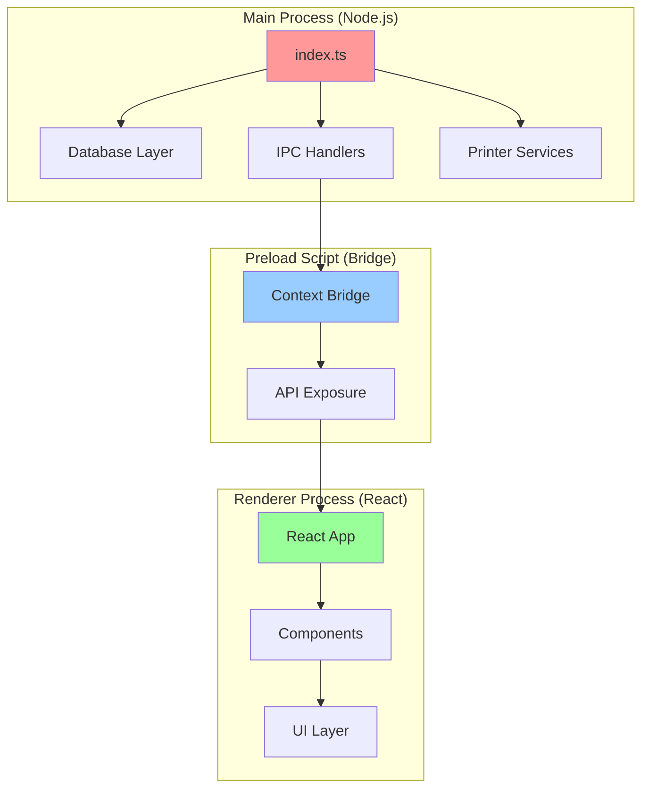
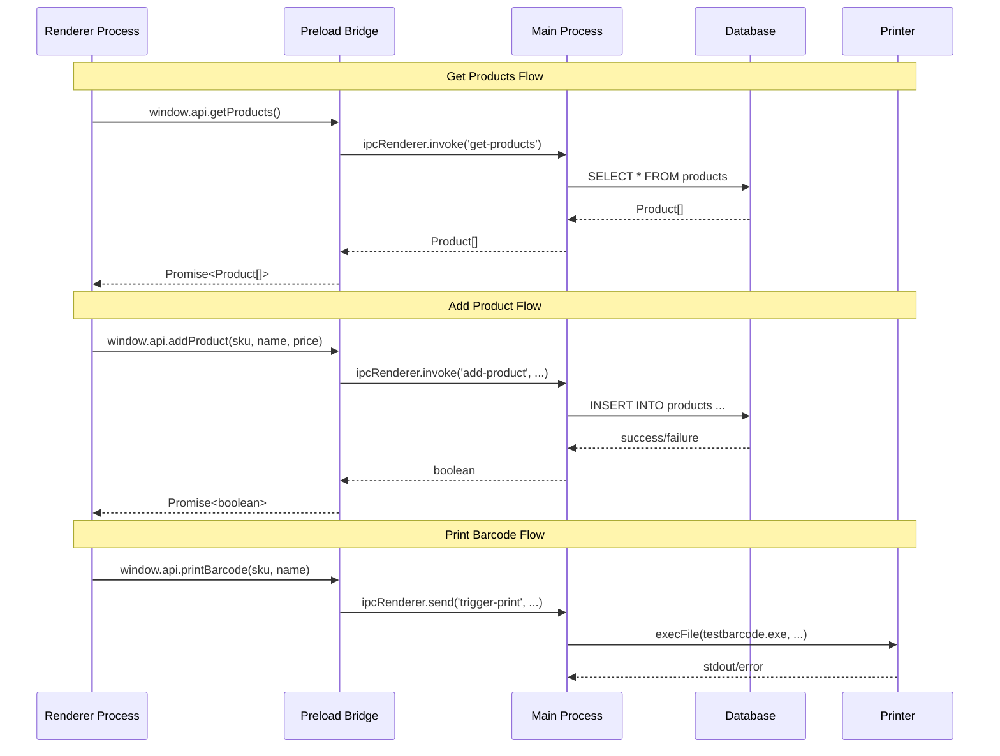
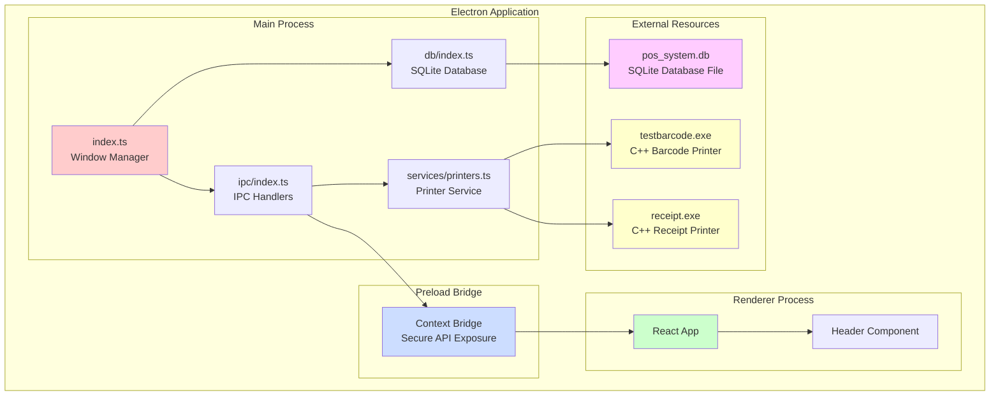

# Do'kondor - POS System Codebase Documentation

> **AI-Friendly Reference Documentation**  
> Last Updated: 2026-02-12  
> Version: 2.0.0

---

## Table of Contents

1. [Project Overview](#project-overview)
2. [Architecture](#architecture)
3. [Technology Stack](#technology-stack)
4. [Project Structure](#project-structure)
5. [Core Components](#core-components)
6. [Database Schema](#database-schema)
7. [IPC Communication](#ipc-communication)
8. [Printer Integration](#printer-integration)
9. [Build & Development](#build--development)
10. [Key Files Reference](#key-files-reference)

---

## Project Overview

**Do'kondor** is an Electron-based Point of Sale (POS) system built with React and TypeScript. The application integrates:
- SQLite database for product management
- Barcode label printing
- Receipt printing via C++ executables
- Modern React UI with TypeScript type safety

### Application Purpose
This is a desktop POS application designed for retail environments, providing:
- Product inventory management
- Barcode label generation and printing
- Receipt printing functionality
- Local SQLite database storage

---

## Architecture

### Electron Multi-Process Architecture

The application follows Electron's standard three-process architecture:



### Process Responsibilities

| Process | Location | Responsibilities |
|---------|----------|------------------|
| **Main** | `src/main/` | Window management, database operations, IPC handling, printer services |
| **Preload** | `src/preload/` | Secure bridge between main and renderer, API exposure via contextBridge |
| **Renderer** | `src/renderer/` | React UI, user interactions, display logic |

---

## Technology Stack

### Core Technologies

| Category | Technology | Version | Purpose |
|----------|-----------|---------|---------|
| **Framework** | Electron | 39.2.6 | Desktop application framework |
| **UI Library** | React | 19.2.1 | Frontend UI components |
| **Language** | TypeScript | 5.9.3 | Type-safe development |
| **Database** | better-sqlite3 | 12.6.2 | Local SQLite database |
| **Build Tool** | electron-vite | 5.0.0 | Fast Vite-based build system |
| **Bundler** | Vite | 7.2.6 | Fast development and build |
| **Packaging** | electron-builder | 26.0.12 | Application packaging |

### Development Tools

- **ESLint** - Code linting with React-specific rules
- **Prettier** - Code formatting
- **TypeScript** - Static type checking
- **electron-updater** - Auto-update functionality

---

## Project Structure

```
owner/
├── src/
│   ├── main/                    # Main process (Node.js)
│   │   ├── index.ts            # Entry point, window creation
│   │   ├── db/
│   │   │   └── index.ts        # Database initialization & access
│   │   ├── ipc/
│   │   │   └── index.ts        # IPC handler registration
│   │   └── services/
│   │       └── printers.ts     # Printer service (C++ exe integration)
│   │
│   ├── preload/                 # Preload scripts (Bridge)
│   │   ├── index.ts            # Context bridge implementation
│   │   └── index.d.ts          # TypeScript type definitions
│   │
│   └── renderer/                # Renderer process (React)
│       ├── index.html          # HTML entry point
│       └── src/
│           ├── main.tsx        # React entry point
│           ├── App.tsx         # Root React component
│           ├── components/
│           │   └── Header.tsx  # Navigation header component
│           ├── pages/          # (Empty - future page components)
│           ├── types/          # (Empty - future type definitions)
│           └── assets/         # (Empty - future static assets)
│
├── resources/                   # Application resources
│   ├── bin/
│   │   ├── testbarcode.exe    # C++ barcode printer executable
│   │   └── receipt.exe        # C++ receipt printer executable
│   ├── icon.ico               # Windows icon
│   └── icon.png               # Application icon
│
├── build/                       # Build resources (icons, etc.)
├── out/                         # Compiled output
├── dist/                        # Distribution packages
│
├── package.json                 # Project dependencies & scripts
├── electron.vite.config.ts     # Vite configuration
├── electron-builder.yml        # Build/packaging configuration
├── tsconfig.json               # TypeScript project references
├── tsconfig.node.json          # TypeScript config for Node.js code
├── tsconfig.web.json           # TypeScript config for React code
└── eslint.config.mjs           # ESLint configuration
```

---

## Core Components

### 1. Main Process (`src/main/index.ts`)

**Purpose**: Application entry point, manages the main Electron window and lifecycle.

**Key Functions**:
- `createWindow()` - Creates the main BrowserWindow with specific configurations
- Initializes database on app ready
- Registers IPC handlers
- Handles window lifecycle events

**Configuration**:
```typescript
{
  width: 1024,
  height: 768,
  autoHideMenuBar: true,
  sandbox: false,  // Required for Node.js integration
  preload: '../preload/index.js'
}
```

**Lifecycle Hooks**:
- `app.whenReady()` - Initialize DB, IPC, create window
- `app.on('window-all-closed')` - Close DB connection, quit app (except macOS)
- `app.on('activate')` - Recreate window on macOS dock click

---

### 2. Database Layer (`src/main/db/index.ts`)

**Purpose**: SQLite database initialization and access management.

**Database Location**: `{userData}/pos_system.db`
- Development: `%APPDATA%/owner/pos_system.db`
- Production: Same location

**Schema**:
```sql
CREATE TABLE IF NOT EXISTS products (
  id INTEGER PRIMARY KEY AUTOINCREMENT,
  sku TEXT UNIQUE,
  name TEXT,
  price REAL,
  stock INTEGER DEFAULT 0
);
```

**API**:
- `initializeDatabase()` - Creates/opens database, initializes tables
- `getDB()` - Returns database instance (throws if not initialized)

**Usage Pattern**:
```typescript
// In main/index.ts
initializeDatabase();  // On app ready

// In other modules
const db = getDB();
const stmt = db.prepare('SELECT * FROM products');
```

---

### 3. IPC Handlers (`src/main/ipc/index.ts`)

**Purpose**: Handles inter-process communication between renderer and main process.

**Registered Handlers**:

| Channel | Type | Parameters | Returns | Purpose |
|---------|------|------------|---------|---------|
| `get-products` | handle | none | `Product[]` | Fetch all products from database |
| `add-product` | handle | `sku, name, price` | `boolean` | Insert new product into database |
| `trigger-print` | on | `sku, name` | void | Trigger barcode label printing |
| `trigger-receipt` | on | `storeName, items, total` | void | Trigger receipt printing |

**Error Handling**:
- Database errors are caught and logged
- Returns `false` on insert failure
- Console logs errors for debugging

---

### 4. Printer Services (`src/main/services/printers.ts`)

**Purpose**: Integrates with C++ printer executables for barcode and receipt printing.

**Binary Path Resolution**:
```typescript
// Development: owner/resources/bin/
// Production: {resourcesPath}/bin/
```

**Services**:

#### `printLabel(sku, productName)`
- Executable: `testbarcode.exe`
- Printer: `label`
- Arguments: `[printerName, sku, productName]`
- Use case: Print barcode labels for products

#### `printReceipt(storeName, items, total)`
- Executable: `receipt.exe`
- Printer: `receipt`
- Arguments: `[printerName, storeName, itemsString, total]`
- Items format: `"Item1|1.00;Item2|2.00"`
- Use case: Print customer receipts

**Integration Pattern**:
```typescript
execFile(exePath, args, (error, stdout) => {
  if (error) console.error('Error:', error);
  else console.log('Success:', stdout);
});
```

---

### 5. Preload Bridge (`src/preload/index.ts`)

**Purpose**: Secure bridge exposing limited APIs to renderer process.

**Security Model**:
- Uses `contextBridge` for secure API exposure
- Prevents direct Node.js access from renderer
- Type-safe API definitions

**Exposed APIs**:

```typescript
window.api = {
  // Printer APIs
  printBarcode: (sku: string, name: string) => void
  printReceipt: (storeName: string, items: Product[], total: string) => void
  
  // Database APIs
  getProducts: () => Promise<Product[]>
  addProduct: (sku: string, name: string, price: number) => Promise<boolean>
}

window.electron = ElectronAPI  // From @electron-toolkit/preload
```

**Type Definitions** (`index.d.ts`):
- Extends `Window` interface globally
- Provides TypeScript autocomplete in renderer
- Ensures type safety across process boundary

---

### 6. React Application (`src/renderer/src/`)

**Entry Point** (`main.tsx`):
```typescript
createRoot(document.getElementById('root')!).render(
  <StrictMode>
    <App />
  </StrictMode>
)
```

**Root Component** (`App.tsx`):
- Currently renders only `Header` component
- Minimal structure ready for expansion

**Components**:

#### Header (`components/Header.tsx`)
- **Props**: `{ title: string }`
- **Renders**: Navigation bar with title and menu items (Home, About, Contact)
- **Styling**: Inline styles (border-bottom, flexbox layout)
- **Current Usage**: `<Navbar title="My App" />`

**UI Architecture**:
- React 19 with StrictMode
- TypeScript for type safety
- Inline styles (no CSS framework currently)
- Component-based architecture ready for expansion

---

## Database Schema

### Products Table

| Column | Type | Constraints | Description |
|--------|------|-------------|-------------|
| `id` | INTEGER | PRIMARY KEY AUTOINCREMENT | Unique product identifier |
| `sku` | TEXT | UNIQUE | Stock Keeping Unit (barcode) |
| `name` | TEXT | - | Product name |
| `price` | REAL | - | Product price |
| `stock` | INTEGER | DEFAULT 0 | Current stock quantity |

**Indexes**:
- Primary key on `id` (automatic)
- Unique constraint on `sku`

**Future Considerations**:
- Add `created_at`, `updated_at` timestamps
- Add `category` field for product categorization
- Add `description` field for detailed product info
- Consider soft deletes with `deleted_at` field

---

## IPC Communication

### Communication Flow



### Channel Reference

**Bidirectional (invoke/handle)**:
- `get-products` - Query database for all products
- `add-product` - Insert new product into database

**One-way (send/on)**:
- `trigger-print` - Fire-and-forget barcode printing
- `trigger-receipt` - Fire-and-forget receipt printing

---

## Printer Integration

### Architecture

The application uses **external C++ executables** for printer communication:

```
Renderer → Preload → Main → execFile() → C++ Executable → Physical Printer
```

### Binary Executables

#### testbarcode.exe
- **Purpose**: Print barcode labels
- **Size**: ~137 KB
- **Arguments**: `[printerName, sku, productName]`
- **Printer Name**: `"label"`

#### receipt.exe
- **Purpose**: Print customer receipts
- **Size**: ~749 KB
- **Arguments**: `[printerName, storeName, itemsString, total]`
- **Printer Name**: `"receipt"`
- **Items Format**: Semicolon-separated `name|price` pairs
  - Example: `"Apple|1.50;Banana|0.75"`

### Path Resolution

```typescript
const getBinaryPath = (binaryName: string): string => {
  return app.isPackaged
    ? path.join(process.resourcesPath, 'bin', binaryName)
    : path.join(__dirname, '../../resources/bin', binaryName)
}
```

**Development**: `owner/resources/bin/testbarcode.exe`  
**Production**: `{app}/resources/bin/testbarcode.exe`

### Error Handling

- Errors logged to console
- No user-facing error messages currently
- Async execution (fire-and-forget pattern)

**Improvement Opportunities**:
- Add error callbacks to renderer
- Implement print job status tracking
- Add retry logic for failed prints
- Validate printer availability before execution

---

## Build & Development

### NPM Scripts

| Script | Command | Purpose |
|--------|---------|---------|
| `dev` | `electron-vite dev` | Start development server with hot reload |
| `build` | `typecheck && electron-vite build` | Build for production |
| `build:win` | `build && electron-builder --win` | Build Windows installer |
| `build:mac` | `build && electron-builder --mac` | Build macOS app |
| `build:linux` | `build && electron-builder --linux` | Build Linux packages |
| `start` | `electron-vite preview` | Preview production build |
| `typecheck` | `tsc --noEmit` | Type check all code |
| `lint` | `eslint --cache .` | Lint code |
| `format` | `prettier --write .` | Format code |

### Development Workflow

1. **Install dependencies**: `npm install`
2. **Start dev server**: `npm run dev`
3. **Make changes**: Hot reload active for renderer process
4. **Type check**: `npm run typecheck`
5. **Build**: `npm run build:win` (or platform-specific)

### Build Configuration

**electron-vite.config.ts**:
- Main process: Standard Node.js build
- Preload: Standard Node.js build
- Renderer: React + Vite with `@renderer` alias

**electron-builder.yml**:
- App ID: `com.electron.app`
- Product Name: `owner`
- Output: NSIS installer for Windows
- Resources: Unpacked for C++ executables
- Auto-update: Configured (generic provider)

### TypeScript Configuration

**Project References**:
- `tsconfig.json` - Root config with project references
- `tsconfig.node.json` - Main + Preload processes
- `tsconfig.web.json` - Renderer process (React)

---

## Key Files Reference

### Configuration Files

| File | Purpose | Key Settings |
|------|---------|--------------|
| `package.json` | Dependencies, scripts | React 19, Electron 39, better-sqlite3 |
| `electron.vite.config.ts` | Build configuration | Renderer alias: `@renderer` |
| `electron-builder.yml` | Packaging config | NSIS installer, resource unpacking |
| `tsconfig.*.json` | TypeScript settings | Strict mode, project references |
| `eslint.config.mjs` | Linting rules | React, TypeScript, Prettier integration |

### Source Files

| File | Lines | Purpose | Key Exports |
|------|-------|---------|-------------|
| `main/index.ts` | 64 | Main process entry | `createWindow()` |
| `main/db/index.ts` | 36 | Database layer | `initializeDatabase()`, `getDB()` |
| `main/ipc/index.ts` | 36 | IPC handlers | `registerIpcHandlers()` |
| `main/services/printers.ts` | 42 | Printer service | `PrinterService.printLabel()`, `printReceipt()` |
| `preload/index.ts` | 46 | Context bridge | `api` object |
| `preload/index.d.ts` | 22 | Type definitions | `Window` interface extension |
| `renderer/src/main.tsx` | 10 | React entry | Root render |
| `renderer/src/App.tsx` | 13 | Root component | `App` component |
| `renderer/src/components/Header.tsx` | 20 | Navigation | `Navbar` component |

### Resource Files

| File | Size | Purpose |
|------|------|---------|
| `resources/bin/testbarcode.exe` | 137 KB | Barcode printer executable |
| `resources/bin/receipt.exe` | 749 KB | Receipt printer executable |
| `resources/icon.png` | 5 KB | Application icon |
| `resources/icon.ico` | 106 KB | Windows icon |

---

## Development Notes for AI

### Code Patterns

1. **Database Access**: Always use `getDB()` after initialization
2. **IPC**: Use `invoke/handle` for async operations, `send/on` for fire-and-forget
3. **Type Safety**: All APIs have TypeScript definitions in preload
4. **Error Handling**: Currently minimal - improvement opportunity
5. **Path Resolution**: Use `app.isPackaged` to differentiate dev/prod paths

### Extension Points

1. **Add New IPC Channel**:
   - Register handler in `main/ipc/index.ts`
   - Add method to `api` object in `preload/index.ts`
   - Update type definitions in `preload/index.d.ts`
   - Use in renderer via `window.api.yourMethod()`

2. **Add Database Table**:
   - Update schema in `main/db/index.ts` `initializeDatabase()`
   - Add IPC handlers for CRUD operations
   - Expose via preload bridge
   - Create TypeScript interface

3. **Add React Component**:
   - Create in `renderer/src/components/`
   - Import and use in `App.tsx` or page components
   - Use `window.api` for backend communication

### Known Limitations

1. **No Error UI**: Errors only logged to console
2. **No Loading States**: No UI feedback for async operations
3. **No Routing**: Single-page app, no navigation
4. **Inline Styles**: No CSS framework or styled-components
5. **No Tests**: No unit or integration tests
6. **Hardcoded Printer Names**: `"label"` and `"receipt"` are hardcoded

### Security Considerations

1. **Sandbox Disabled**: Required for Node.js integration, but reduces security
2. **CSP Configured**: Content Security Policy in `index.html`
3. **Context Isolation**: Enabled via `contextBridge`
4. **External Executables**: C++ binaries executed with user-provided data (potential risk)

---

## Quick Reference Commands

```bash
# Development
npm install              # Install dependencies
npm run dev             # Start development server

# Type Checking
npm run typecheck       # Check all TypeScript
npm run typecheck:node  # Check main/preload only
npm run typecheck:web   # Check renderer only

# Code Quality
npm run lint            # Lint code
npm run format          # Format code

# Building
npm run build           # Build all processes
npm run build:win       # Build Windows installer
npm run build:mac       # Build macOS app
npm run build:linux     # Build Linux packages

# Preview
npm start               # Preview production build
```

---

## Architecture Diagram



---

## Summary

This is a **production-ready Electron POS application** with:
- ✅ SQLite database integration
- ✅ IPC communication layer
- ✅ External printer integration (C++ executables)
- ✅ TypeScript type safety
- ✅ React 19 UI framework
- ✅ Build and packaging configuration
- ⚠️ Minimal error handling
- ⚠️ No routing or complex UI
- ⚠️ No automated tests

**Best suited for**: Retail environments needing basic product management and printing capabilities.

**Next steps for development**:
1. Add comprehensive error handling and user feedback
2. Implement routing and additional pages
3. Add CSS framework or styled-components
4. Create unit and integration tests
5. Implement loading states and optimistic UI updates
6. Add more database tables (sales, customers, etc.)
7. Implement proper logging system
8. Add configuration management
